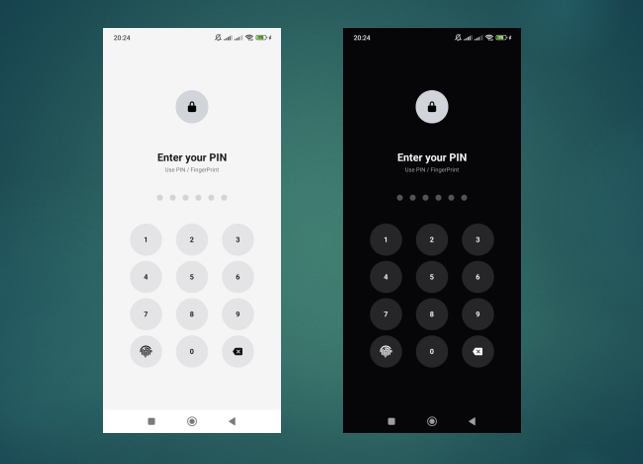
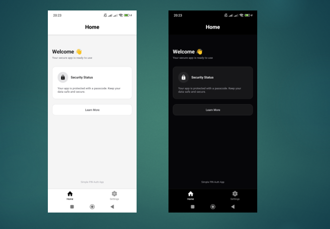
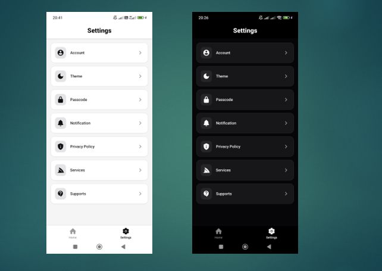
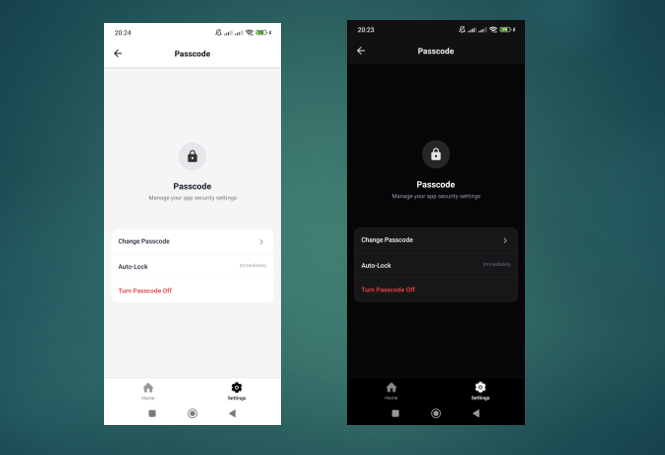

# Expo Secure Auth Starter

A modern, reusable authentication starter template built with **Expo React Native**, featuring PIN lock, biometric authentication, and dark mode support.

This project is designed as a **plug-and-play starter kit** for apps that require secure local authentication without rebuilding the same logic from scratch.

---

## Features

- PIN-based lock screen (6-digit secure input)
- Biometric authentication (Fingerprint)
- Dark / Light mode support
- Smooth and responsive UI using NativeWind
- Local authentication state persistence

---

## 📱 App Preview

> Replace these images with your actual screenshots in `/assets/screenshots/`

### Lock Screen



### Home Screen (Light Mode)



### Settings Screen



### Passcode Screen



---

## Purpose

This project is built to serve as a **starter foundation** for React Native / Expo applications that require authentication.

Instead of implementing PIN lock, biometrics, and theme switching repeatedly, you can:

- Clone this project
- Customize UI
- Extend features

---

## Tech Stack

- Expo (React Native)
- TypeScript
- NativeWind
- Expo Local Authentication

## Getting Started

### 1. Install dependencies

```bash
npm install
```

### 2. Start development server

```bash
npx expo start
```
